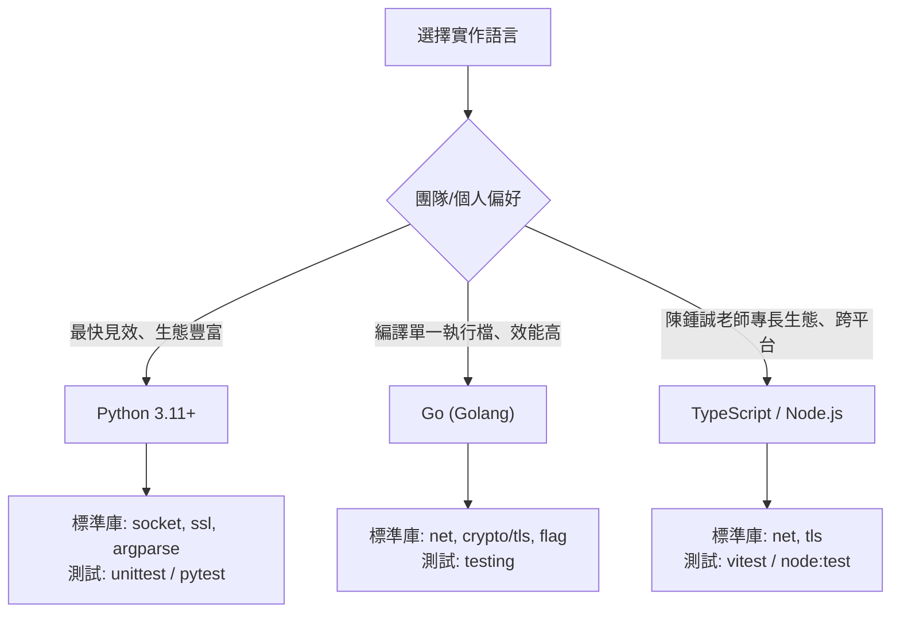
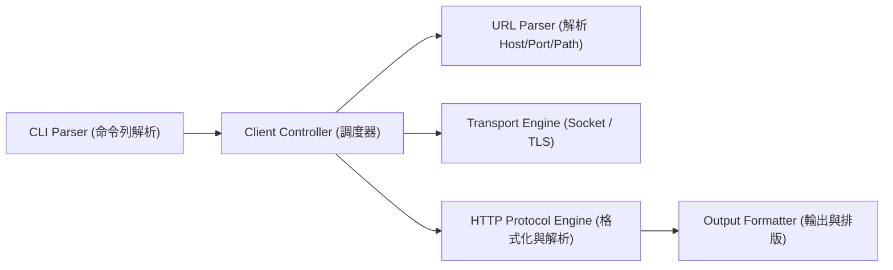
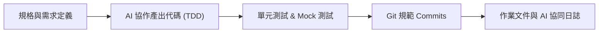

# 類似 curl 專案程式：可行性分析與現代軟體工程開發規劃

> **專案目標**：使用 AI 協同開發一款輕量化、跨平台、符合現代軟體工程規範的命令列 HTTP 客戶端工具（類似 `curl`）。  
> **課程背景**：國立金門大學資訊工程系《現代軟體工程》作業 1  

---

## 一、 可行性分析 (Feasibility Analysis)

### 1.1 技術可行性 (Technical Feasibility)
開發一個簡化版的 `curl` 在技術上**完全可行**，且非常適合作為軟體工程的實踐主題。`curl` 的本質是**透過網路 Socket 依循應用層協議（HTTP/HTTPS）進行請求打包與響應解析的工具**。

依實作深度可分為三個級別：

| 實作層級 | 實作方式 | 困難度 | 學習價值與軟工表現 | 建議評估 |
| :--- | :--- | :---: | :--- | :--- |
| **Level 1: 封裝現成庫** | 使用現成高階庫（如 Python `requests`、Go `net/http`、Node `axios`）僅包裝 CLI 參數。 | ★☆☆☆☆ | 偏低。僅練習到 CLI 參數解析，缺乏協議與底層網路處理。 | 不推薦（恐被認為缺乏實質內容） |
| **Level 2: 手刻 HTTP 協議 + 底層 Socket/TLS（採用）** | 使用語言底層 `socket` 與 `tls/ssl`，自行解析 URL、格式化 HTTP 請求文字、解析 HTTP 狀態碼/標頭/內容。 | ★★★☆☆ | **極高**。深刻理解 RFC 規範、TCP 連線、TDD 單元測試、Mock 測試與架構分層。 | **強烈推薦（最佳平衡點）** |
| **Level 3: 硬核全手刻** | 連 TLS 密碼學握手、HTTP/2 多路複用全部自己寫。 | ★★★★★ | 偏離學期作業範圍，耗時過長且容易遇到邊界問題。 | 不推薦 |

> [!TIP]
> **建議選擇 Level 2**：在 AI 輔助下，手寫 HTTP/1.1 協議格式化器與狀態機解析器約能在數小時內完成，既能展現資工系底層知識（Socket、HTTP 協議），又能體現現代軟體工程的架構與測試實踐。

### 1.2 AI 協作可行性 (AI-Assisted Feasibility)
現代 LLM（如 Gemini 2.5/Claude 3.7/GPT-4o）在以下方面具備極高成熟度：
1. **RFC 規範落地**：精準生成 HTTP/1.1（RFC 9110/9112）請求與響應格式規範代碼。
2. **測試驅動開發 (TDD)**：快速撰寫各種邊界案例的測試（畸形 Headers、Chunked Transfer、超大 Body、Timeout 等）。
3. **重構與模組化**：協助將單一腳本重構成遵循 SOLID 原則的現代架構。

---

## 二、 語言與技術選型比較 (Tech Stack)

推薦以下三種現代開發語言，皆具備跨平台且內建網路 Socket 支援：

1. **Python (採用)**:
   - **優點**：語法精練、內建 `socket` 與 `ssl` 模組完備；測試編寫極其敏捷；AI 生成 Python 代碼的正確率最高。
2. **Go**:
   - **優點**：編譯產出單一可執行檔（就像真正的 `curl.exe`），自帶並行與強大標準庫，非常貼近雲原生工具開發。
3. **TypeScript / Node.js**:
   - **優點**：非同步 I/O，陳鍾誠教授於開源教學上經常採用 JavaScript/Node.js 生態，親和度高。

---

## 三、 系統架構設計 (System Architecture)

專案採分層模組化架構，避免單一檔案肥大，符合現代軟體工程之高內聚、低耦合原則：

### 核心模組職責
1. **CLI Parser**：解析命令列參數，例如 `-X POST`、`-H "Header: value"`、`-d "body"`、`-v`（詳細除錯日誌）、`-o output.txt`、`-L`（跟隨重定向）、`-u user:pass`。
2. **URL Parser**：拆解 URL 結構（Schema: `http`/`https`、Host、Port: 80/443、Path、Query String）。
3. **Transport Layer**：
   - 負責建立 TCP 握手 (`socket.connect`)。
   - 若為 `https`，建立 TLS 加密層 (`ssl.wrap_socket`)。
   - 逾時（Timeout）與連線例外處理。
4. **HTTP Protocol Engine**：
   - **Request Builder**：按照 RFC 9112 組合出標準 HTTP 封包（`METHOD /path HTTP/1.1\r\nHost: ...\r\n\r\n`）。
   - **Response Parser**：解析 HTTP 狀態行、Headers 字典切分、Body 讀取（包含 `Content-Length` 與 `Transfer-Encoding: chunked` 支援）。
5. **Output Formatter**：支援純文字輸出、寫入檔案、Verbose 模式顯示請求/響應標頭。

---

## 四、 核心功能範疇規劃 (Feature Scope)

為了在合理的作業時程內達到最佳軟工評分，規劃 MVP 與進階功能：

### 4.1 MVP (最小可行產品 - 第一階段)
- [x] 支援 `GET` 請求
- [x] 支援 HTTP 與 HTTPS (TLS 握手)
- [x] 支援自訂 Header (`-H "User-Agent: my-curl"`)
- [x] 支援自訂 Method (`-X POST`, `-X PUT`, `-X DELETE`)
- [x] 支援 Request Body 發送 (`-d "data"`)
- [x] 支援將內容儲存為檔案 (`-o filename`)
- [x] 支援 Verbose 模式 (`-v`)，印出連線資訊與傳輸標頭

### 4.2 進階功能 (增值亮點 - 第二階段)
- [x] 支援跟隨 301/302 重定向 (`-L`)
- [x] 支援 Chunked Transfer Encoding 響應解析
- [x] 支援自訂逾時時間 (`--timeout 10`)
- [x] 支援簡易 Basic Authentication (`-u user:pass`)
- [x] 支援包含 Response Headers 輸出 (`-i`)

---

## 五、 現代軟體工程規範與交付物規劃

在陳鍾誠教授的軟工課中，**代碼本身只佔一半，另一半在於軟體工程流程與方法論**：

1. **測試驅動開發 (TDD) 與自動化測試**：
   - 針對 HTTP Parser 編寫單元測試（包含各種狀態碼、特殊 Headers、畸形響應）。
   - 建立本地輕量 HTTP Mock Server（測試重定向、逾時、自訂標頭）。
2. **Git Commit 規範**：
   - 採用 Conventional Commits（`feat:`, `fix:`, `test:`, `docs:`, `refactor:`）。
3. **AI 協同開發記錄 (關鍵加分項)**：
   - 撰寫 `AI_PROMPTS.md`，詳列對話 Prompt、AI 產出代碼、發現的 edge case 與除錯歷程。
4. **完整專案文檔 (`README.md`)**：
   - 安裝方式、使用教學、架構圖、測試覆蓋率說明。
